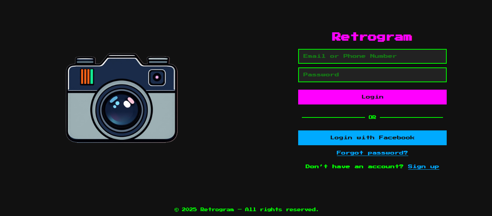
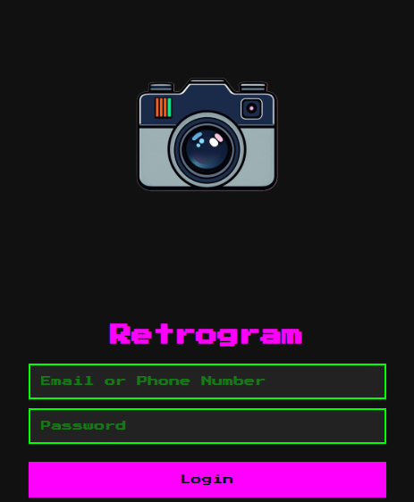
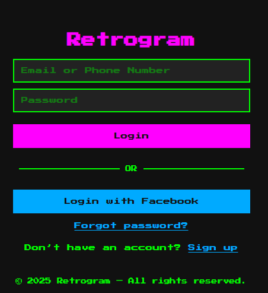

# Retro Scocial Media Login Clone
A simple, retro-style login page inspired by Instagram’s design.
This project was created for educational purposes to practice front-end development skills using HTML and CSS.

> **Note:** This project is **not affiliated with or endorsed by Instagram or Meta**. It does not attempt to collect user data and is intended purely for learning and portfolio demonstration.

## 🔍 Features

- Responsive login form layout
- Clean, vintage design style
- CSS animations and transitions
- Front-end only (no backend or real authentication)

## 🛠️ Built With

- HTML5
- CSS3

## 📸 Screenshots

| Desktop View | Mobile View |
|--------------|-------------|
|  | <br>*Mobile Screenshot 1*<br><br><br>*Mobile Screenshot 2* |

## 🚀 Getting Started

To view the project locally:

1. Clone the repository:
   ```bash
   git clone https://github.com/rsan7/retro-web.git
